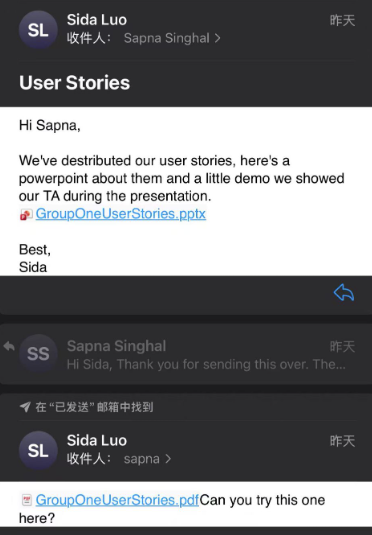
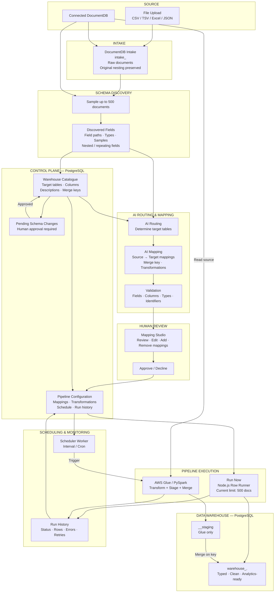

# GenLedge Connector - !!!!!!!

> _Note:_ This document will evolve throughout your project. You commit regularly to this file while working on the project (especially edits/additions/deletions to the _Highlights_ section). 
>
> **This document will serve as a master plan between your team, your partner and your TA.**

## Product Details
 
#### Q1: What is the product?

GenLedge is an AI-powered ERP platform designed to act as a digital workforce for enterprise operations, using AI agents to automate tasks that would traditionally require employees to process business information manually.

Business information can enter the platform through sources such as email, sales orders, purchase orders, banking systems, and other external systems. Agents then use the information available in the ERP to perform business processes such as processing invoices, tracking deliveries, making payments, and managing interactions with vendors and customers, while recording the resulting information in the ERP's database.

This creates a large and continuously growing collection of operational data that businesses need to analyze. Traditionally, extracting and preparing this data for analytics requires engineers or analysts to manually determine what information is needed, connect different data sources, and build data pipelines to move and transform it.

For example, an enterprise may want to know how each vendor has performed over the past month: how many goods they delivered, how much they should be paid, and whether they delivered on time. A person would traditionally have to gather and combine this information from the ERP database and prepare it for a report.

Our project aims to automate this process with an agentic data pipeline. The user specifies a source and the desired target data, and the AI agent examines the source and target structures, determines how the data should be mapped and transformed, and generates the pipeline for approval and execution.

Our team will build this as a web-based application focused primarily on the backend, covering the pipeline from extracting data from the ERP database, providing the relevant data and tools to the AI agent, executing the generated pipeline, and exporting analytics-ready data into a separate target database. The next team will focus on using this preprocessed data to build an agent that could answer all user inquiries on the data (for example, to analyze sales trends).

*Refer to [pipeline visualization](https://drive.google.com/file/d/1Iw_YCqHsjISCauQNGoym3mWENR66wOL0/view?usp=drive_link), [genledge platform diagram](https://drive.google.com/file/d/1lNJbsDIhyfYPJpp-XcwnQV9R-BybB56t/view?usp=sharing), and [mockup figma](https://www.figma.com/make/5FBkZzoaCpGV83S88IPkY1/Demo?code-node-id=0-6\&fullscreen=1)*

#### Q2: Who are your target users?

Our primary target users are data and operations analysts at mid-sized and large businesses that rely on ERP systems to manage complex supply-chain and financial operations. For example, consider a large electronics manufacturer that works with hundreds or thousands of suppliers providing components such as batteries, screens, and chips. The company's ERP system records purchase orders, deliveries, inventory receipts, invoices, payments, and vendor information. An operations or data analyst may want to answer questions such as: Which suppliers delivered late this month? What is the average delivery time for each supplier? How much product did each supplier deliver, and how much should they be paid?

Traditionally, answering these questions can require a data engineer or analyst to identify the relevant ERP tables and fields, connect information about purchase orders, deliveries, vendors, and payments, and manually build a data pipeline that transforms the operational data into a format suitable for analytics. As the number of vendors, transactions, and data sources grows, maintaining these pipelines becomes increasingly difficult.

Our product targets the employee responsible for preparing this data for analytics, rather than the executive simply viewing the final dashboard. The user specifies the source ERP data and the desired analytics dataset. The AI agent then examines the available data, determines how source fields should map to the target, proposes necessary transformations, and generates an executable pipeline. The user can review and modify the agent's work before approving it.

#### Q3: Why would your users choose your product? What are they using today to solve their problem/need?

Our product helps company data administrators and finance and operations teams turn enterprise records into useful business information with less manual effort. Data administrators need to prepare reliable reporting data, while business users need answers without understanding database structures or writing queries.

Today, the workflows rely on employees operating ERP systems and developers manually building data pipelines using scripts or configuring no-code tools. Our application reduces this setup work: an AI agent examines source and target structures, proposes mappings and transformations, and prepares a pipeline for human review and approval.

Once the data is available, users can ask questions such as “How much did we pay each vendor?” and receive a report or dashboard. Connecting payment, order, and delivery records can make vendor performance and purchasing trends easier to identify—information that exists in enterprise data but otherwise requires manual queries and analysis.

Users would choose our product for faster data preparation, easier access to business insights, and control over AI-generated mappings. A separate reporting database also reduces the need to repeatedly query the operational ERP. 
Similar functionality exists in modern ERP and data-management platforms, particularly for data integration, reporting, and analytics. However, our application is designed around an AI-agent-driven workflow rather than traditional rule-based configuration or manually operated ERP tools.

Modern enterprise ERP systems are primarily designed to store, manage, and process business records. While some platforms are adding AI assistants, their core workflows are generally not built around autonomous agents that can examine data structures, determine mappings and transformations, prepare data pipelines, and support users through the analytics process.

Our application takes an agentic approach by placing the AI agent at the centre of the data preparation and analytics workflow. The agent can reason about source and target structures, propose how data should be transformed, and prepare pipelines for human review and approval. This reduces the amount of manual configuration required from data administrators while maintaining human control over the final result.

The partner envisions a broader ERP automation ambition of reducing some eight-hour workloads to one or two hours.

This supports GenLedge’s stated direction: using AI assistants to perform repetitive enterprise work while people review results and focus on higher-value activities.

#### Q4: What are the user stories that make up the Minimum Viable Product (MVP)?

##### US1 - Authentication:

As a user of the app, I want to sign in securely in order to access GenLedge and manage my organization's data.

##### US2 - Import Data

As a data owner, I want to upload files or connect my organization's database in order to make my organization's data available to GenLedge for processing.

##### US3 - Discover Source Data

As a data owner, I want GenLedge to automatically discover and display the structure of my source data in order to understand what information is available for processing.

##### US4 - Automatically Map / Route Data

As a data owner, I want GenLedge to automatically determine where my source data belongs in the warehouse in order to reduce the amount of manual data engineering required.

##### US5 - Review and Modify Mappings

As a data reviewer, I want to review and modify source-to-warehouse mappings in order to ensure that my data is mapped correctly before it is loaded.

##### US6 - Transform and Load Data

As a data reviewer, I want GenLedge to transform and load mapped source data into the warehouse in order to produce clean, structured data for analytics.

##### US7 - Schedule and Monitor Pipelines

As a data operator, I want to schedule and monitor my data pipelines in order to keep the warehouse data up to date and identify failed data loads.

  
   
  <em>User story sent to partner</em>

#### Q5: Have you decided on how you will build it? Share what you know now or tell us the options you are considering.

##### **Technology Stack**

**Frontend**
- **React** — UI framework
- **Vite** — Build tool and development server
- **TypeScript** — Programming language
- **React Flow** — Mapping Studio visualization and interaction

**Backend**
- **Node.js** — JavaScript runtime
- **TypeScript** — Programming language
- **Fastify** — Web framework
- **PostgreSQL** — Relational database
- **Prisma** — ORM for database access

**AI Agent**
- **LangGraph.js** — Agent orchestration and workflow management
- **Claude API / OpenAI API** — Large language model API

**Data Processing**
- **Python** — Data processing and transformation runtime

##### **System Architecture**

----

## Intellectual Property Confidentiality Agreement 

> Note this section is **not marked** but must be completed briefly if you have a partner. If you have any questions, please ask on Piazza.
>  

1. You can share the software and the code freely with anyone with or without a licence, regardless of domain, for any use.
2. You can upload the code to GitHub or other similar publicly available domains.
3. You will only share the code under an open-source licence with the partner but agree to not distribute it in any way to any other entity or individual.
4. You will share the code under an open-source licence and distribute it as you wish but only the partner can access the system deployed during the course.
5. **Selected option.** You will only reference the work you did in your resume and interviews. You agree not to share the code or software unless the partner agrees.

**Reason for the choice:** We cannot sign the NDA or IP agreement. The partner will provide project direction only. The partner will not provide code, schemas, databases, protocols, real data, repositories, or implementation details. We will build the project from zero. We will design our own schemas, test inputs, mock data, and implementation. We will not share our code or software unless the partner agrees.

----

## Teamwork Details

#### Q6: Have you met with your team?

  
  
   
  <em>Team-building dinner at Haidilao Hotpot</em>

For our team-building activity, all members of our group went to Haidilao Hotpot for dinner together. We enjoyed hot pot, shared food, and had a chance to talk and get to know each other better outside of class. It was a fun and relaxing experience that helped us become more comfortable with one another and strengthened our teamwork.

Fun Facts:
- Steven has a 4.0 cGPA.
- Steven tutored everyone on this team to play basketball, football, and badminton, and to go jogging, swimming, rock climbing, marathon running, weightlifting, and diving. He was also once sponsored by Red Bull.
- Michael won first place in a go-kart tournament.

#### Q7: What are the roles & responsibilities on the team?
#### Team Roles

##### Software-Related Roles

###### Sida — AI Integration & LLM APIs
I chose this role because it focuses on the practical use of AI and APIs. I want to learn how these tools should be used correctly and make better decisions about when and how to use them. This will also help me strengthen my practical experience with AI and API integration.

###### Daniel — Agentic Loop & Liaison
I chose this role because I want to learn how to build an AI agent and understand the agentic loop. I also want to gain more experience with APIs, cloud services, and system integration. My past experience with AI and data pipelines will help me contribute to this part of the project. As the liaison, I will also communicate with the supervisor and bring their feedback back to the team.

###### Yifu Liang — Backend API & System Integration
I chose the backend role to gain hands-on experience with APIs, cloud services, and system integration. My previous experience with AI and data pipelines gives me a good foundation to contribute to the team while developing more practical backend engineering skills.

###### Steven Yang — Data Ingestion & Processing
I’d like to work on this part because it matches my previous experience well. During my internship, I worked on a Python data pipeline that involved API integration, filtering, deduplication, and structured data processing. I have also built database-backed applications, so I want to apply that experience to GenLedge's data ingestion and processing.

###### Xiran — Schema Discovery & Data Representation
I chose this role because I have experience developing interactive data visualizations with D3.js and building responsive, multi-page web applications. Working with source data and its structure lets me build on my experience with presenting and organizing data, while also developing a deeper understanding of how the data is processed before it is used by the rest of the system.

###### Kunyu Li — Pipeline Workflow & System Development
I chose this role because I have experience designing interactive, user-friendly, and easy-to-understand interfaces. I want to apply that experience to how data pipelines are organized and managed, while also learning more about the technical side of system development and how different parts of the pipeline work together.

###### Wuqingyi Wang — Database & Warehouse
I chose this role because I have previous experience with PostgreSQL, relational database design, and API-backed applications. I am interested in working with the database and warehouse layer while also learning how AI agents analyze ERP data, generate mappings and transformations, and improve through validation and human feedback.

##### Non-Software-Related Roles

| Member | Role | Responsibilities |
|---|---|---|
| **Daniel** | Liaison & Agentic Loop Design | Design the overall agentic workflow and take responsibility for deploying the MVP on the team’s infrastructure. |
| **Sida** | Technical Research | Research the AI frameworks, LLM APIs, and other technologies needed for the project. |
| **Yifu Liang** | Documentation | Maintain technical documentation, architecture decisions, and important project information. |
| **Steven Yang** | Input Mock Data Generation | Create realistic ERP-style datasets and different data structures for development and demonstration. |
| **Xiran** | Test Design | Design test cases for the data pipeline, schema discovery, mappings, and edge cases. |
| **Kunyu Li** | Project Logistics | Track meetings, deadlines, tasks, and other project coordination work. |
| **Wuqingyi Wang** | Deployment | Manage the deployment of the MVP, including setting up the hosting environment, configuring the domain, and making sure the deployed system is accessible and running properly. |

#### Q8: How will you work as a team?

**Meeting plan:** 

Our team plans to have meetings every Tuesday. Before the TUT meeting, we will have a short team meeting to summarize our progress from the previous week, share development updates, and prepare questions for our TA. We will then meet with our TA during TUT to resolve questions and clarify uncertainties about our technical development. After that, we will meet with our project partners to report our weekly progress and clarify any questions or misunderstandings. Finally, we will have a team meeting after the partner meeting to summarize the outcomes and divide the work for the following week. These meetings will mainly be online, and we will record the meeting notes in Notion.

We will also have additional coding sessions, code reviews, and quick team syncs when needed. The time for these sessions is flexible, so we can schedule them based on the team's progress and availability.

Before D1 is due, we will have two meetings with our project partner. The first meeting was on September 22 and lasted about one hour. Our partner gave us an overall introduction and explained the project. The second meeting was on October 1 and lasted about 40 minutes. We discussed questions about the user stories and technical stack. After D1, we plan to have regular meetings with our partner every Thursday at 6:00 PM to discuss progress and address any new questions.

  
#### Q9: How will you organize your team?

We will use a combination of **Notion, GitHub, and group communication channels** to organize our work and track project progress.

- **Task tracking and documentation**
  - We will use **Notion** as the main workspace for:
    - To-do lists
    - Task boards
    - Weekly plans and schedules
    - Meeting agendas and meeting minutes
    - Important decisions and partner/TA feedback
  - Tasks will be organized by status so that the team can clearly see their progress from creation to completion.
  - Our TA and project partner will be given access to the relevant project-management resources.

- **Task prioritization**
  - Tasks will be prioritized based on:
    - Upcoming deliverable deadlines
    - Dependencies between different components
    - Features required for the current milestone or demo
    - Feedback and requirements received from our TA and project partner
  - Blocking or high-dependency tasks will be addressed earlier when they affect other members' work.
  - For technical development, we will follow a planned development order. We will first set up TypeScript, Node.js, and the project structure. Then, we will develop the backend using Fastify, PostgreSQL, and Prisma. After that, we will implement Python data processing. We will then add the AI agent using LangGraph.js and the Claude/OpenAI API. Next, we will develop the frontend using React, Vite, and React Flow. We will then integrate the full pipeline. Finally, we will add scheduling and monitoring.

- **Task assignment**
  - Tasks will mainly be assigned during our **weekly team meetings**.
  - Work will be distributed according to each member's role, current workload, experience, and learning interests.
  - Larger features may be divided into smaller tasks and assigned to multiple members when collaboration is required.

- **Tracking task status**
  - Tasks will move through different stages on the Notion task board, such as:
    - `To Do`
    - `In Progress`
    - `Review`
    - `Done`
  - Team members will update the status of their assigned tasks as work progresses.
  - Progress will also be reviewed during weekly team meetings and adjusted when necessary.

- **Code collaboration and version control**
  - We will use **GitHub** for source-code management and version control.
  - Development work will be organized using branches, commits, and pull requests.
  - Pull requests will allow team members to review changes before they are merged into the shared codebase.
  - The repository will remain private. We will not distribute the code publicly unless the partner agrees.
  - The repository will also be used to track the implementation status of different project components.

- **Team and partner communication**
  - A group chat will be used for day-to-day communication, quick questions, and coordination between team members.
  - Email will be used when appropriate for formal communication with the project partner.
  - Questions, uncertainties, and progress will also be discussed regularly with our **TA and project partner** to make sure the team remains aligned with project expectations.

#### Q10: What are the rules regarding how your team works?

**Communications:**

* What is the expected frequency? What methods/channels will be used?

  We will use WeChat as our main communication platform within the team. We will use email/WhatsApp when communicating with our partners.

* If you have a partner project, what is your process for communicating with your partner? Who is responsible?

  We will be communicating via university email with our partner. Daniel is the primary contact between the team and the partner.

**Collaboration:**

* How are people held accountable for attending meetings, completing action items? What is your process?

  **Fixed cadence:** We hold a weekly team sync, a weekly partner sync (as needed), and async standups on other weekdays.

  **Advance notice:** If someone cannot attend, they must notify the team at least 24 hours in advance (except in emergencies) and post a written update covering completed work, next steps, and blockers.

  **Meeting notes:** A rotating note-taker records decisions, action items, and owners in a shared doc.

  **Missed meetings:** The absent member must review the notes and complete any assigned actions before the next sync.

  **Rotating roles:** Facilitator, note-taker, and action-item tracker rotate so no one silently disengages.

* How will you address the issue if one person doesn't contribute or is not responsive?

  **Private check-in (within 24 hours):** The project manager or tech lead reaches out privately to understand blockers—workload, personal issues, unclear tasks, etc. We assume good faith first.

  **Recovery plan (within 48 hours):** If the issue continues, we agree on a concrete recovery plan: smaller scope, paired work, clearer deadlines, or temporary reassignment.

  **Team discussion and documentation:** If there is still no meaningful contribution, the team documents the gap, redistributes critical work, and adjusts the plan to protect deliverables.

  **Escalation to instructor/TA and partner:** If the partner deliverable is at risk, we notify the course instructor/TA and the GenLedge contact. We do not let one person silently block the project.

  **Formal peer evaluation:** Contribution logs and peer assessments are used for grading. If necessary, the member is removed from the critical path and work is reassigned.

## Organisation Details

#### Q11. How does your team fit within the overall team organisation of the partner?

Our team will act as an independent product development team within GenLedge’s broader AI-native ERP initiative. The partner will give us project direction, requirements, priorities, and feedback.

Our primary responsibility is to improve the path from enterprise data to useful business insights. This includes developing AI-assisted source-to-target mappings, enabling users to review and approve pipelines, and building reporting capabilities for finance and operations users. These features support the broader ERP without requiring our team to build the entire platform.

We will build the data engineering and processing pipeline from zero. We will design our own schemas, test inputs, mock data, and implementation. We will not use partner code, databases, schemas, protocols, repositories, or other implementation materials. We will test the pipeline and verify that mappings, transformations, and reports work correctly.

This role fits our team’s experience with data processing, LLMs, AI agents, and full-stack development. It matches the partner’s expectation that we build and test a reliable project from zero.

#### Q12. How does your project fit within the overall product from the partner?

**Fit within GenLedge:** GenLedge already has an ERP platform where AI agents automate operational workflows. Our project adds the analytics layer on top of this system, turning ERP and related business data into analytics-ready datasets, reports, and dashboards without placing reporting workloads directly on the operational system. 

**Our contribution:** We will build the pipeline from scratch. We will create the schemas, test inputs, mock data, and implementation. The pipeline will support source discovery, agentic mappings, transformations, human review, loading, and monitoring.

**Partner contribution/dependencies:** The partner will provide project direction, requirements, priorities, and feedback. The partner will not provide code, schemas, databases, protocols, real data, repositories, or production infrastructure.

**Other Team Contribution:** There will be another team from this course working on the analytics portion. As the data is processed, they will use another pipeline to answer users’ questions by allowing another AI agent to access that data.

**Success:** The project succeeds when the agent can generate useful mappings, an admin can verify and execute them end-to-end, and the resulting curated data powers at least one meaningful customer-facing report with drill-down capability. 

**Product:** We expect the project to end with a functional prototype that includes all the key features required for the data pipeline to run end-to-end. The prototype should demonstrate the main workflow, from importing and mapping data to transforming, loading, and monitoring the pipeline. It does not need to be a production-ready product, but it should provide a working demonstration of the core functionality.

## Potential Risks

#### Q13. What are some potential risks to your project?

**Incorrect AI-generated mappings:** The agent may generate inaccurate source-to-target mappings or transformations, especially when schemas are ambiguous or customer data is inconsistent. Since the project explicitly assumes that LLM outputs may be incomplete or wrong, we will keep a human-in-the-loop workflow where admins review, edit, and approve configurations before execution.

**Unresolved architecture decisions:** Some production choices are still open, including whether AWS Glue can handle GenLedge's nested DocumentDB data, how transformations should be divided between mappings, SQL/dbt, and Lambda, and whether QuickSight satisfies reporting requirements. Early prototypes and technical spikes will help us resolve these before they block later work.

**Limited access to partner systems:** The partner will not provide production systems or real data. We will use local and mock environments for development and testing. We will design our own test inputs.

**Limited partner support due to IP restrictions:** The partner will provide direction and feedback only. The partner will not provide exact input schemas, real data examples, code, or detailed implementation information. We will use representative schemas, mock data, and test inputs that we design ourselves.

**Enterprise data privacy with external LLMs:** Using external LLM APIs may create privacy concerns if sensitive enterprise data is sent to an external provider. We need to determine what data can safely be sent to the LLM and how it should be protected. We will minimize the amount of sensitive data sent to the model, avoid sending unnecessary personally identifiable or confidential information, and investigate appropriate enterprise API privacy and data-handling options before integrating the LLM. Where possible, we will send metadata such as schemas and sample structures rather than full production records.

#### Q14. What are some potential mitigation strategies for the risks you identified?

**Limited partner support due to IP restrictions:** We will design all test inputs and mock data ourselves. We will use schemas from open-source or publicly documented ERP systems when useful. We will validate requirements through the partner’s direction and feedback.

**Unresolved architecture decisions:** We have a general picture of the overall architecture, but some technical decisions will be made as we develop the project. We will use prototypes and testing to help us determine the best approach as we move forward.
