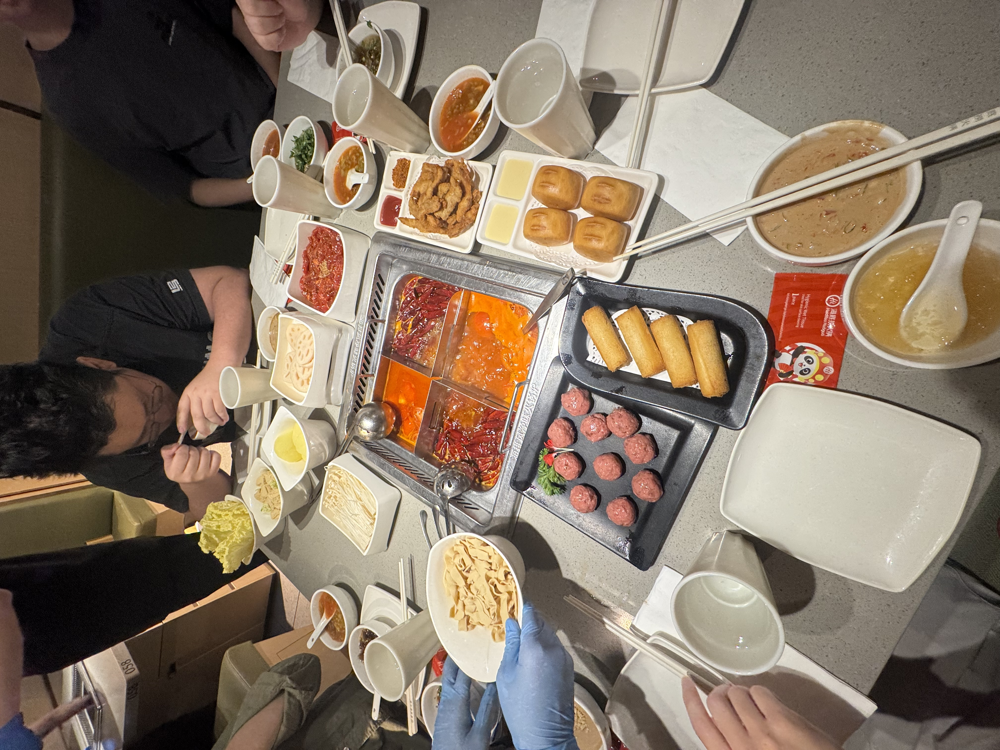
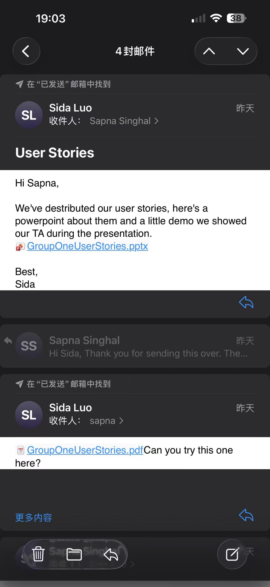

# GenLedge Connector/!!!!!!!

> _Note:_ This document will evolve throughout your project. You commit regularly to this file while working on the project (especially edits/additions/deletions to the _Highlights_ section). 
>
> **This document will serve as a master plan between your team, your partner and your TA.**

## Product Details
 
#### Q1: What is the product?

GenLedge is an AI-powered ERP platform designed to act as a digital workforce for enterprise operations, using AI agents to automate tasks that would traditionally require employees to process business GenLedge is an AI-powered ERP platform designed to act as a digital workforce for enterprise operations, using AI agents to automate tasks that would traditionally require employees to process business information manually.

Business information can enter the platform through sources such as email, sales orders, purchase orders, banking systems, and other external systems. Agents then use the information available in the ERP to perform business processes such as processing invoices, tracking deliveries, making payments, and managing interactions with vendors and customers, while recording the resulting information in the ERP's database.

This creates a large and continuously growing collection of operational data that businesses need to analyze. Traditionally, extracting and preparing this data for analytics requires engineers or analysts to manually determine what information is needed, connect different data sources, and build data pipelines to move and transform it.

For example, an enterprise may want to know how each vendor has performed over the past month: how many goods they delivered, how much they should be paid, and whether they delivered on time. A person would traditionally have to gather and combine this information from the ERP database and prepare it for a report.

Our project aims to automate this process with an agentic data pipeline. The user specifies a source and the desired target data, and the AI agent examines the source and target structures, determines how the data should be mapped and transformed, and generates the pipeline for approval and execution.

Our team will build this as a web-based application focused primarily on the backend, covering the pipeline from extracting data from the ERP database, providing the relevant data and tools to the AI agent, executing the generated pipeline, and exporting analytics-ready data into a separate target database.

#### Q2: Who are your target users?

Our primary target users are data and operations analysts at mid-sized and large businesses that rely on ERP systems to manage complex supply-chain and financial operations. For example, consider a large electronics manufacturer that works with hundreds or thousands of suppliers providing components such as batteries, screens, and chips. The company's ERP system records purchase orders, deliveries, inventory receipts, invoices, payments, and vendor information. An operations or data analyst may want to answer questions such as: Which suppliers delivered late this month? What is the average delivery time for each supplier? How much product did each supplier deliver, and how much should they be paid?

Traditionally, answering these questions can require a data engineer or analyst to identify the relevant ERP tables and fields, connect information about purchase orders, deliveries, vendors, and payments, and manually build a data pipeline that transforms the operational data into a format suitable for analytics. As the number of vendors, transactions, and data sources grows, maintaining these pipelines becomes increasingly difficult.

Our product targets the employee responsible for preparing this data for analytics, rather than the executive simply viewing the final dashboard. The user specifies the source ERP data and the desired analytics dataset. The AI agent then examines the available data, determines how source fields should map to the target, proposes necessary transformations, and generates an executable pipeline. The user can review and modify the agent's work before approving it.

#### Q3: Why would your users choose your product? What are they using today to solve their problem/need?

Our product helps GenLedge’s data administrators and finance and operations teams turn enterprise records into useful business information with less manual effort. Data administrators need to prepare reliable reporting data, while business users need answers without understanding database structures or writing queries.

Today, the workflows described by our partner rely on employees operating ERP systems and developers manually building data pipelines using scripts or configuring no-code tools. Our application reduces this setup work: an AI agent examines source and target structures, proposes mappings and transformations, and prepares a pipeline for human review and approval.

Once the data is available, users can ask questions such as “How much did we pay each vendor?” and receive a report or dashboard. Connecting payment, order, and delivery records can make vendor performance and purchasing trends easier to identify—information that exists in enterprise data but otherwise requires manual queries and analysis.

Users would choose our product for faster data preparation, easier access to business insights, and control over AI-generated mappings. A separate reporting database also reduces the need to repeatedly query the operational ERP. Accuracy remains a requirement to validate through testing, rather than an assumed benefit of using AI.

The partner described a broader ERP automation ambition of reducing some eight-hour workloads to one or two hours. This is an illustrative estimate, not a measured result for our MVP; we will assess our own savings by comparing manual and assisted completion times.

This supports GenLedge’s stated direction: using AI assistants to perform repetitive enterprise work while people review results and focus on higher-value activities.

#### Q4: What are the user stories that make up the Minumum Viable Product (MVP)?
[Figma Demo](https://www.figma.com/make/5FBkZzoaCpGV83S88IPkY1/--------CSC301-D1-Demo?p=f&t=dNeXPEpMKdHMtUZw-0)
##### US1 - Authentication：

As a user of the app, I want to sign in securely in order to access GenLedge and manage my organization's data.

##### US2 - Import Data

As a data owner, I want to upload files or connect my organization's database in order to make my organization's data available to GenLedge for processing.

##### US3 - Discover Source Data

As a data owner, I want GenLedge to automatically discover and display the structure of my source data in order to understand what information is available for processing

##### US4 - Automatically Map / Route Data

As a data owner, I want GenLedge to automatically determine where my source data belongs in the warehouse in order to reduce the amount of manual data engineering required.

##### US5 - Review and Modify Mappings

As a data reviewer, I want to review and modify source-to-warehouse mappings in order to ensure that my data is mapped correctly before it is loaded.

##### US6 - Transform and Load Data

As a data reviewer, I want GenLedge to transform and load mapped source data into the warehouse in order to produce clean, structured data for analytics.

##### US7 - Schedule and Monitor Pipelines

As a data operator, I want to schedule and monitor my data pipelines in order to keep the warehouse data up to date and identify failed data loads.

#### Q5: Have you decided on how you will build it? Share what you know now or tell us the options you are considering.
Frontend
- React
- Vite
- TypeScript
- React Flow — only for the Mapping Studio

Backend
- Node.js
- TypeScript
- Fastify
- PostgreSQL
- Prisma

Agent
- LangGraph.js
- Claude or OpenAI

Data processing
- Python

For the MVP deployment, we will use our own infrastructure to host GenLedge. We will use a Raspberry Pi and our own domain. This keeps the setup simple and low cost. It also lets us focus on the core agentic pipeline. If GenLedge is expanded later, we can move to AWS services such as S3, AWS Glue, and hosted PostgreSQL to support larger workloads.

## Intellectual Property Confidentiality Agreement 
You can share the software and the code freely with anyone with or without a license, regardless of domain, for any use.

## Teamwork Details

#### Q6: Have you met with your team?

- Steven has a 4.0 cGPA.
- Steven tutored everyone on this team to play basketball, football, badminton, jogging, swimming, cross - country, rock climbing, marathon, lifting, and diving. He was also once sponsored by Red Bull.
- Michael, a member of our team, won first place in a go-kart tournament.

#### Q7: What are the roles & responsibilities on the team?

Overall roles: 2 Frontend (visualization), 5 backend (API, data pipeline, cloud service, A.I.)

Sida - backend: I chose this because this bit would be around practical use of AI and API’s which would help me in understanding how these practical tools should be correctly used so that I could use them wisely and strengthen my skills with using them.

Daniel - backend & liaison: I chose backend because I want to learn how to build an AI agent and understand the agentic loop. I also want to gain more experience with APIs, cloud services, and system integration. My past experience with AI and data pipelines will help me contribute to the team. This role will also help me improve my backend skills and learn how these tools are used in a real system.

Yifu Liang - backend: I chose the backend role to gain hands-on experience with APIs, cloud services, and system integration. My previous experience with AI and data pipelines allows me to contribute effectively while also developing practical backend engineering skills that I have had less exposure to.

Steven Yang - backend: I’d like to work on backend because that’s the area that matches my experience best. During my internship I worked on a Python data pipeline involving API integration, filtering, deduplication, and structured data processing, and I’ve also built database-backed applications before. 

Xiran - frontend: Choosing this role since I have experience developing interactive data visualizations with D3.js and building responsive, multi-page web applications. I am interested in applying these skills to design clear and engaging visualizations while further improving my frontend development skills.

Kunyu Li - Frontend: I chose this role because I have experience designing interactive, user-friendly, and easy-to-understand interfaces, and I’m interested in learning more about frontend development and design. 

Wuqingyi Wang - backend: I chose this role because I have previous experience with PostgreSQL, relational database design, and API-backed applications. I am interested in how AI agents analyze ERP data, generate mappings and transformations, and improve through validation and human feedback.

#### Q8: How will you work as a team?

Meeting plan: 

- On Tuesday: 
  - Team meet before TUT: summarize weekly outcome and prepare questions to communicate with our amazing TA 
  - TUT meeting with TA: clarify confusion, ask suggestions in technical development, etc. 
  - Team meeting after partner meetings: summarize all the meeting outcomes, and allocate work for each member for the next week. 
  - Meeting log in Notion 
 
- On Thursday: 
  - Meeting with partners: report weekly progress, clarify any questions/misunderstandings that emerged
  - Internal team meeting after the partner meeting: discuss the feedback received from the partner, confirm any required changes, and determine the direction for the next round of development.

  
#### Q9: How will you organize your team?
We will use a combination of **Notion, GitHub, and group communication channels** to organize our work and track project progress.

- **Task tracking and documentation**
  - We will use **Notion** as the main workspace for:
    - To-do lists
    - Task boards
    - Weekly plans and schedules
    - Meeting agendas and meeting minutes
    - Important decisions and partner/TA feedback
  - Tasks will be organized by status so that the team can clearly see their progress from creation to completion.
  - Our TA and project partner will be given access to the relevant project-management resources.

- **Task prioritization**
  - Tasks will be prioritized based on:
    - Upcoming deliverable deadlines
    - Dependencies between different components
    - Features required for the current milestone or demo
    - Feedback and requirements received from our TA and project partner
  - Blocking or high-dependency tasks will be addressed earlier when they affect other members' work.

- **Task assignment**
  - Tasks will mainly be assigned during our **weekly team meetings**.
  - Work will be distributed according to each member's role, current workload, experience, and learning interests.
  - Larger features may be divided into smaller tasks and assigned to multiple members when collaboration is required.

- **Tracking task status**
  - Tasks will move through different stages on the Notion task board, such as:
    - `To Do`
    - `In Progress`
    - `Review`
    - `Done`
  - Team members will update the status of their assigned tasks as work progresses.
  - Progress will also be reviewed during weekly team meetings and adjusted when necessary.

- **Code collaboration and version control**
  - We will use **GitHub** for source-code management and version control.
  - Development work will be organized using branches, commits, and pull requests.
  - Pull requests will allow team members to review changes before they are merged into the shared codebase.
  - The repository will also be used to track the implementation status of different project components.

- **Team and partner communication**
  - A group chat will be used for day-to-day communication, quick questions, and coordination between team members.
  - Email will be used when appropriate for formal communication with the project partner.
  - Questions, uncertainties, and progress will also be discussed regularly with our **TA and project partner** to make sure the team remains aligned with project expectations.

#### Q10: What are the rules regarding how your team works?

**Communications:**

* What is the expected frequency? What methods/channels will be used?

  We will use WeChat as our main communication platform among the team. We will use email/WhatsApp when communicating with our partners. 

* If you have a partner project, what is your process for communicating with your partner? Who is responsible?

  We will be communicating via university email with our partner. Daniel is the primary contact between the team and the partner.

**Collaboration:**

* How are people held accountable for attending meetings, completing action items? What is your process?

  **Fixed cadence:** We hold a weekly team sync, a weekly partner sync (as needed), and async standups on other weekdays.

  **Advance notice:** If someone cannot attend, they must notify the team at least 24 hours in advance (except emergencies) and post a written update covering: done, next, blockers.

  **Meeting notes:** A rotating note-taker records decisions, action items, and owners in a shared doc.

  **Missed meetings:** The absent member must review the notes and complete any assigned actions before the next sync.

  **Rotating roles:** Facilitator, note-taker, and action-item tracker rotate so no one silently disengages.

* How will you address the issue if one person doesn't contribute or is not responsive?

  **Private check-in (within 24 hours):** The project manager or tech lead reaches out privately to understand blockers—workload, personal issues, unclear tasks, etc. We assume good faith first.

  **Recovery plan (within 48 hours):** If the issue continues, we agree on a concrete recovery plan: smaller scope, paired work, clearer deadlines, or temporary reassignment.

  **Team discussion and documentation:** If there is still no meaningful contribution, the team documents the gap, redistributes critical work, and adjusts the plan to protect deliverables.

  **Escalation to instructor/TA and partner:** If the partner deliverable is at risk, we notify the course instructor/TA and the GenLedge contact. We do not let one person silently block the project.

  **Formal peer evaluation:** Contribution logs and peer assessments are used for grading. If necessary, the member is removed from the critical path and work is reassigned.

## Organisation Details

#### Q11. How does your team fit within the overall team organisation of the partner?

Our team will act as a product development team focused on data engineering and analytics within GenLedge’s broader AI-native ERP initiative. We will work with the founder and operations lead to clahrify requirements and priorities, and use the existing developer’s knowledge to understand and extend the current MVP.

Our primary responsibility is to improve the path from enterprise data to useful business insights. This includes developing AI-assisted source-to-target mappings, enabling users to review and approve pipelines, and building reporting capabilities for finance and operations users. These features support the broader ERP without requiring our team to build the entire platform.

Our role also includes software maintenance and quality assurance. The partner explained that the existing prototype contains incomplete functionality and bugs, so we will investigate and improve these areas. For example, we will verify that mappings transfer records correctly and that vendor-payment reports produce accurate totals. This reflects the partner’s emphasis on reliability: incorrect analytics could influence real financial decisions.

This role fits our team’s experience with data processing, LLMs, AI agents, and full-stack development. It also matches the partner’s expectation that we first understand the existing architecture and then contribute tested improvements to a product intended for real customers.

#### Q12. How does your project fit within the overall product from the partner?

**Fit within GenLedge:** GenLedge already has an ERP platform where AI agents automate operational workflows. Our project adds the analytics layer on top of this system, turning ERP and related business data into analytics-ready datasets, reports, and dashboards without placing reporting workloads directly on the operational system. 

**Our contribution:** We are extending an existing MVP rather than starting from scratch. The current prototype supports source introspection, target creation, manual pipeline mapping, run history, and data loading; our main contribution is evolving this into an agentic pipeline where the LLM proposes mappings and transformations and admins review or override them. 

**Partner contribution/dependencies:** GenLedge provides the existing ERP, data sources, current pipeline prototype, repository, and production infrastructure context. Their engineering/platform team remains responsible for broader connector, security, observability, and infrastructure concerns. 

**Success:** The project succeeds when the agent can generate useful mappings, an admin can verify and execute them end-to-end, and the resulting curated data powers at least one meaningful customer-facing report with drill-down capability. 

## Potential Risks

#### Q13. What are some potential risks to your project?

**Incorrect AI-generated mappings:** The agent may generate inaccurate source-to-target mappings or transformations, especially when schemas are ambiguous or customer data is inconsistent. Since the project explicitly assumes that LLM outputs may be incomplete or wrong, we will keep a human-in-the-loop workflow where admins review, edit, and approve configurations before execution. 

**Unresolved architecture decisions:** Some production choices are still open, including whether AWS Glue can handle GenLedge's nested DocumentDB data, how transformations should be divided between mappings, SQL/dbt, and Lambda, and whether QuickSight satisfies reporting requirements. Early prototypes and technical spikes will help us resolve these before they block later work. 

**Access to production dependencies:** Final validation requires authorized access to real source and target environments rather than only local mock databases. Delays in credentials, infrastructure, or representative data could slow integration, so we should request access early while maintaining mock environments for development. 

**Scope and integration complexity:** Moving from the current ETL-style MVP toward S3, Redshift, authentication, agentic configuration, and analytics involves several architectural changes rather than simple component replacements. We should prioritize the end-to-end agentic mapping workflow first and defer lower-priority production enhancements if necessary.

#### Q14. What are some potential mitigation strategies for the risks you identified?
Establish a more efficient communication channel between team and partner.
Be specific on the user story and evaluate the workload accurately. 
Be reasonable on the project scope. 

